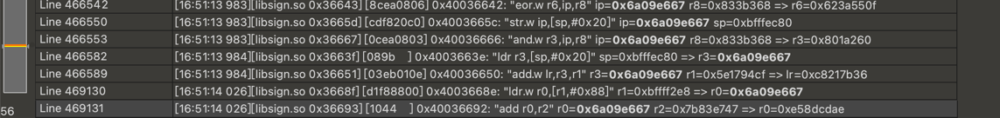

样本 app

1.定位sign
apk加固，so加固

先脱壳，jadx没有搜索到"mfsig"，apk里的使用的字符串，调用加固的解密函数。然后进行封装。

最后找到加密函数 位于 "cn.xxxxx.wsg.SecurityLib.nativesign()"

传入的参数分别是 context ，时间戳和字节数组。

    let SecurityLib = Java.use("cn.missfresh.wsg.SecurityLib");
    var strcls=Java.use("java.lang.String")
    SecurityLib["nativeSign"].implementation = function (context, j, bArr) {
    console.log('nativeSign is called' + ', ' + 'context: ' + context + ', ' + 'j: ' + j + ', ' + 'bArr: ' + strcls.$new(bArr));
    let ret = this.nativeSign(context, j, bArr);
    console.log('nativeSign ret value is ' + ret);
    return ret;
    };

主动调用 call_sign

    var strcls=Java.use("java.lang.String")
    var arg1=Java.use("android.app.ActivityThread").currentApplication().getApplicationContext();
    var time=1648631301174;
    var byte=strcls.$new("1234567890").getBytes();
    var retval=Java.use("cn.missfresh.wsg.SecurityLib").nativeSign(arg1,time,byte);
    console.log("call sign retval :",retval)

call sign retval : mfsnmtyAodyBmtmEWFx59h5hV4+CLZo9G590IJWKKK94Kls/KZsDFlSHIlkAJlkELJJbHl+4IlK5Il0cI5O8J5S4EIgJM7cIGZS/IJ+OI612KJ9BK+n6mte2na

2.使用Unidbg 分析so

    使用frida dump_so。
    
    Unidbg模拟执行。完整代码在文件中。

    分析算法有很多方式，今天采用trace 的方式还原。
    
    使用Unidbg封装好的trace api。保存trace.txt
    
    编写一个010脚本。查询常用密码的魔数。最后搜索到的

    搜索 sha256 K表中的第一个值 0x428A2F98 发现有 8处调用

    再搜搜 IV 的第一个值 0x6a09e667 也有很多
 
    集中在46W行左右

按照 SHA256 的规定，作为最后一个分组，它要进行填充。
首先是数据填充，以 0x80 开头，填充许多的 00。最后的 64 比特，或者说最后的 8 字节，要用来记录输入内容的长度，单位是比特。按大端序的布局放在末尾的八字节上

在具体的 SHA256 处理逻辑里，从第一个分组开始运算，其结果会参与第二个分组的运算，循环往复，最后一个分组的运算结果就是整体的结果。
着重看每个分组的具体运算上，首先分组内容会以 4 字节为间隔，按小端序处理为 W0 - W15。
`// w0 - w15 就是对应分组的明文
for (i = 0, j = 0; i < 16; ++i, j += 4)
m[i] = (data[j] << 24) | (data[j + 1] << 16) | (data[j + 2] << 8) | (data[j + 3]);
// w16 - w64 这 48 个值通过编排规则生成
for ( ; i < 64; ++i)
m[i] = SIG1(m[i - 2]) + m[i - 7] + SIG0(m[i - 15]) + m[i - 16];`

每一个分组运算
`w16 = w0 + σ0 + w9 + σ1`

选择σ0，它的生成基于 Wx 做移位和异或得来的，rigthrotate(循环右移) 18 位这种逻辑，干扰信息自然也少。

在010里搜索，`ror.*?#18` 没有搜索到。换个 `ror.*?#0x12`。这就出来了。一个是移位立即数，一个是移位寄存器 //192
分别在46W行和47W行。

搜索这个地址 0x400365be 共出现 192次 刚好是48的倍数
符合 sha256 循环内需要连续调用 48 次，以生成 W16 - W63。

0x400365be 对应的是 

0x400365c6 对应的是

那么最早先 R3 的值0x7d517547 对应的应该是 W1。那么，它应该会以加法运算的形式参与到 W17 的计算里。

010Editor 搜一下，出现 11 次，加法两次。

分别搜索一下这两个地址。一个出现192次，一个出现了256次

拷贝出来 ，然后把r1的值提取出来

放到cyberchef 去测试一下

看到了里面有大量的 0x36 和0x5c

key :PwwGKgCqZAc2PPb31TLnnqPNVFAAdq/X

测试一下。标准 HMAC-SHA256：
明文：123456
key：PwwGKgCqZAc2PPb31TLnnqPNVFAAdq/X
结果：90cd7397678c6b0dac1c4f50719722a9e94207d1ba2878382b3e40a4462f4719

3.从下往上分析一次

查找 sign的来源。jstring NewStringUTF(JNIEnv *env, const char *bytes);
找到参数二的地址

可以HOOK可以DEBUG打开 最终定位0x402e7000

traceWrite这个地址

ida中跳转 发现是base64 看下码表 发现码表已经被魔改了
hook一下这个函数：
R0是输入，R1 输入的长度 ，R3是buffer
R0明文：
0000: 31 36 34 38 36 33 31 33 30 7A F5 FA F8 7E 87 7F    164863130z...~..
0010: 96 B2 AC AA BB BA AE B1 B5 A9 A9 B1 B0 B9 AD C0    ................
0020: AC B6 B4 BD A9 B9 AB C4 B1 A2 AA AB B1 AD A9 B0    ................
0030: BD AB B8 B3 AC A8 A7 B5 C0 A3 B5 BB AA AE AE B6    ................
0040: AF AA A5 BC AB BB AB AE BD A6 A7 B0 AA BC AB B5    ................
0050: AD AB A3 7B 31 31 37 34                            ...{1174

时间戳不用看，只需要关注7A F5 FA F8 7E 87 7F.....AD AB A3 7B

使用Unidbg traceWrite 0x7A 这个地址的读写，没有trace 到不知道为什么（待研究）

从trace文件中查找把
最后找到 
刚好调用了75次 而魔改base64 的入参中75个字节是在这里生成的。

从trace中可以看出 0x7a = 0x41 + 0x31 + 0x8,现在关注 0x41，0x31，0x8的出处。
0xbfffeea1
0x41的出处：[libsign.so 0x364a5] [405c    ] 0x400364a4: "ldrb r0, [r0, r1]" r0= r1=0x0 => r0=0x41

使用Unidbg查看内存中的值 ： 且循环使用

0x31的出处：[libsign.so 0x3647d] [10f801b0] 0x4003647c: "ldrb.w fp, [r0, r1]" r0=0xbfffee95 r1=0x0 => fp=0x31

使用Unidbg查看内存中的值 ： 时间戳的后四位 循环使用

0x8的出处：[libsign.so 0x364b9] [14f80810] 0x400364b8: "ldrb.w r1, [r4, r8]" r4=0x402a11e0 r8=0x0 => r1=0x8

使用Unidbg查看内存的值： 中间是HMAC-SHA256 计算结果的值的大写。

所以中间75个字节的数据为： hex(08 82 80 80 08 10 01 1A 40 + hex(HMAC-SHA256计算结果(⼤写)) 0x30 0x01) 循环与 固定数据（ABCDEFGH） 与参数时间戳的后四位（hex）相加得到75个字节

最终算法：""mfsn"+魔改（base64）(参数时间戳的前9位 + 上面计算的75个字节+时间戳的后四位)

    

    
