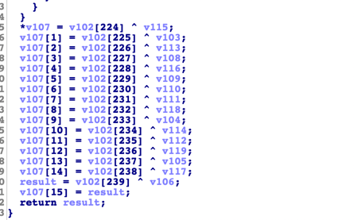
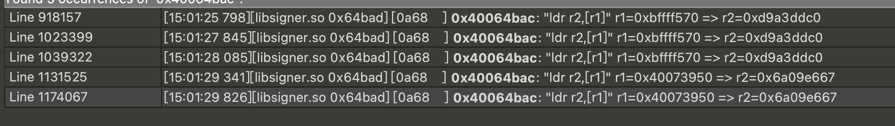

1.模拟执行

2.固定随机
每次执行的结果都不一样。猜测有随机数在里面
绝大多数情况下，程序会使用 arc4random 这样的库函数获取随机数，其底层依赖于 /dev/urandom、/dev/random 等随机文件，或者直接访问这些文件，获取随机数。
在 Unidbg 里，这几个伪设备文件的模拟位置在src/main/java/com/github/unidbg/linux/file/DriverFileIO.java

我们到 RandomFileIO 类里看看，在 randomBytes 函数上添加个断点，通过调试，确认是断下来了。
打印调用栈，查看如何调用的。

运行后，结果为：

在ida中跳转：

发现是个syscall
我们直接注释代码，随机数为0，固定输出。

3.分析算法。
固定输出后，结果一共  96 个字节，前 16 个字节确定是随机数，还剩下 5 排，或者说 80 个字节。

在 Unidbg 里，内存模型简单、固定、窄小。这非常有利于追溯数据源。同时Unidbg 里不存在地址随机化，所以我们只需要知道本次结果生成的地址，然后对它做写入的监控，再重新运行，就能找到数据的写入地址。
在 Android Native 上，函数的返回结果依赖于 JNI 函数的包装，所以我们可以打开 Unidbg 在 JNI 部分的日志输出。

运行可以发现，样本通过 SetByteArrayRegion 这个 JNI 函数，三段式的填充出了最终结果。

结果的 0x60 字节来自三部分
第一部分 ：是随机数，长 0x10 字节，地址来源是 0xbffff468。 
第二部分 ：未知，长 0x30 字节，地址来源是 0xbffff478。
第三部分 ：未知，长 0x20 字节，地址来源是 0xbffff4a8。

首先分析第二部分：
第一个字节为0x1C  traceWrite来源
emulator.traceWrite(0xbffff478l,0xbffff478l);

ida跳转到0x24de

发现结果来自于异或，而且从代码上看，它每次生成 16 个字节。 ==》sub_18D0 每次调用生成16个字节

那么这个函数调用了多少次呢。
ida静态分析，调用了三次。是用unidbg验证一下。

运行得到函数调用流程。发现sub_18d0调用了三次，每次生成16个字节。正好生成第二部分。
特征上很像分组加密算法，分组长度为 0x10。说到分组加密算法，最有名和高频使用的分组加密算法当然是 AES
使用插件搜索，但找不到 AES 的 S 盒或 Rcon。还有一种可能是运行时解密 S 盒。
emulator.attach().addBreakPoint(module.base+0x18d0);

我们可以在这个时机搜索一下内存，看内存里到底有没有 AES S 盒。首先，AES 的 S 盒是一个 256 个元素组成的字节数组。
在 Unidbg Console Debugger 中，可以通过shr搜索可读的堆内存（也就是 0x400xxxxx 这一片），通过st搜索栈内存（也就是 0xbffxxxxx 这一片）。
我以 S 盒的前 8 个字节637c777bf26b6fc5展开搜索，先看看堆。

发现确实找得到 S 盒，而且地址就在目标 SO 内部，在 sub_1A24 的伪代码里，也看到对这片内存的相关操作逻辑。

看来目标函数很可能是 AES 实现，或者至少有关。
我们的函数调用了三次，后面两次，X1 始终是 0xbffff0e0，而且地址上的值也没变化，而 X0 则每次往前推移 0x10，

根据 function trace 的信息，到它的调用方，或者说上层函数 0x34a0 里看看。

对 sub_31D6 做 Hook 看看。

发现参数 1 就是内部 sub_18D0 的参数二，参数 2 是 sub_18D0 的参数一（逐 0x10 字节往后移动），X3 是 0x30，看起来就是待处理数据的长度。
请读者注意 X1 第三行的尾部，是 8 个08，这显然是 PKCS#7 填充。
如果是 AES，还要考虑 IV 是什么？AES-128 还是 192 还是 256？Key 是什么

在调用它之前，参数 1 指向的 16 个字节，和 v4 指向的 16 个字节，做逐字节的异或。这很像是分组加密的 IV，而且是 CBC 模式（加密运算前和明文做异或）。

转到在汇编层面，在异或的起始点，0x33FC 下断.

此时 v3 和 v4 在汇编里对应于 r5 和 r11。

我们对它很熟悉，就是固定住的随机数。这意味着，原来样本 randomBytes(16) 是用来做 IV。与它异或的另一方，也就是分组加密（怀疑是 AES）的明文。
即我们认为，明文是:

长度是 0x30
填充模式是 PKCS#7
IV 是randomBytes，这里被我们固定为 16 个00

想验证猜想的话，没有 Key 可不行。让我们再仔细看看 sub_18d0 函数的内部。
根据经验 sub_18d0的参数二为key；

AES 存在 AES-128、AES-192、AES-256 三种规格，这里是哪一种呢？
AES-128 key为16个字节长度 ：CD 8E EC 8A 99 16 7F 9A 03 CE 8F 2D F5 E1 47 F2
AES-192 key为24个字节长度 ：CD 8E EC 8A 99 16 7F 9A 03 CE 8F 2D F5 E1 47 F2 B9 7D 76 3F 35 D4 21 26
AES-256 key为32个字节长度 ：CD 8E EC 8A 99 16 7F 9A 03 CE 8F 2D F5 E1 47 F2 B9 7D 76 3F 35 D4 21 26 D1 93 24 7F D6 76 40 A1

最后测试为 
AES-256
长度是 0x30
填充模式是 PKCS#7
IV 固定为 16 个00

现在分析KEY的来源

发现来自于目标 SO 的 0xac8。

ida跳转过去 

没看出是什么。hook看一下：

结果是sub_AC8的参数二
而参数二，也就是AES的key来自0xbffff3f8这块内存，对它做写入监控：

赋值发生在 0x65186，让我们看看这里是不是 AES Key 的运算生成处。

v5就是key的生成
*v5 = *(_BYTE *)(v2 + 83);
v5[1] = *(_WORD *)(v2 + 82);
v5[2] = *(_WORD *)(v2 + 80) >> 8; ==> v5[2] = *(_WORD *)(v2 + 81)
v5[3] = *(_DWORD *)(v2 + 80);
这段意思是 逐四个字节做大小端的翻转

那0x65186 处的 R5+80就是没有翻转的数据。hook看一下翻转前的数据：

而翻转前的数据来自 0xbffff3d8 这块内存，对它做写入监控：
 
数据来源于 0x64800
ida跳转：
没看出来是个什么；
如果数据的运算和生成的粒度是四字节，就像这里。那么在常见算法的范畴里，它很可能是哈希算法，比如 MD5、SHA1、SHA256等。

我们在trace里使用Findcrypt

标准SHA-256 实现里，八个 IV 在trace 里搜索 第一个 0x6a09e667，它在执行流里出现的首个地址，似乎就是运算里对 IV 的赋值地点。

搜索这个地址

我们发现样本似乎调用了五次 SHA256 算法，前三次似乎魔改了 IV，最后两次是标准 IV。
下面 IDA 里搜索这个 IV 赋值的地址，0x64bad。

大致对应这个步骤，即 SHA256 结构体的初始化。

void sha256_init(SHA256_CTX *ctx); sub_64BA4
void sha256_update(SHA256_CTX *ctx, const BYTE data[], size_t len); sub_647D4
void sha256_final(SHA256_CTX *ctx, BYTE hash[]);

hook_sub_647D4 查看参数
 
可以看出来就是我们传入的 hashmap中的值 进行拼接 然后sha256
前面已经知道 前三次的sha256 是魔改的。具体的iv可以自己找出来
h0 = 0xd9a3ddc0
h1 = 0x1e54feb3
h2 = 0x36e6643d
h3 = 0x139534ab
h4 = 0xefac33fa
h5 = 0x3a08f627
h6 = 0xe70faa8
h7 = 0xa294be05
然后找份 Python 代码，修改 IV 后试试：
运行结果是6dbba05533a4cc8f4a195bf3f36af72871fab9abc3b0a9a880edfb553f59ab40
回顾前面的分析可以发现，AES 的输入是 8 + 32 字节，此次 HMAC 的结果就是 AES 的后半段 32 字节。前面 8 字节则是硬编码 0x00。

第二次和第三次的 SHA256 输入来自于 SO 里的硬编码，接下来用上面的 Python 代码算出其输出。

第二次 SHA256 结果 : cd8eec8a99167f9a03ce8f2df5e147f2b97d763f35d42126d193247fd67640a1

第三次 SHA256 结果 : 668cc91f8882ab0dee416985c9fae8fb0c520d8fc8d48038dfa81388ca8b70a2

第四次 SHA256

应该敏锐的意识到，这是 HMAC-SHA256 的第一次 SHA256，特征就是大量的666666
那么第五次 SHA256 就是 HMAC-SHA256 的第二次 SHA256 了。

那么 key：668cc91f8882ab0dee416985c9fae8fb0c520d8fc8d48038dfa81388ca8b70a2

我们发现，它就是第三次 SHA256 的结果，即 HMAC-SHA256 的 Key 来自于硬编码内容的魔改 SHA256，或简单理解为硬编码。除此之外，AES-256 的 Key 是第二次 SHA256 的结果。

HMAC-SHA256 的输入则是下面这三行，也就是上面分析的 第二部分：
0000: 1C 0C 88 64 5A 91 FB 5E 5A B2 81 C6 E7 6B C3 35    ...dZ..^Z....k.5
0010: AA 3A 01 38 EB 86 EF 1A D4 22 DB F8 60 18 DE DB    .:.8....."..`...
0020: 51 65 9D 67 BF 8A 9F F8 93 9D 07 E4 0A 1D 8A A5    Qe.g............

这次  HMAC-SHA256 的结果是 咱们的第三部分；

4.总结：
仔细一算，结果这 0x60 个字节都搞清楚了。
首先，它真正的逻辑是选择了 11 个字段，从入参的 hashmap 里取到这些设备信息（map 里没有就不管），拼接起来做魔改 sha256，得到 sign。
将 sign 前面添加了八个0x00字节，然后做 AES 加密，它的 key 为硬编码，这个 AES 结果就是 第二部分。
因为 IV 是随机出来的，所以作为 第一部分 。
第三部分：第二部分做了 HMAC-SHA256，key 为硬编码，这个结果就是 第三部分；

